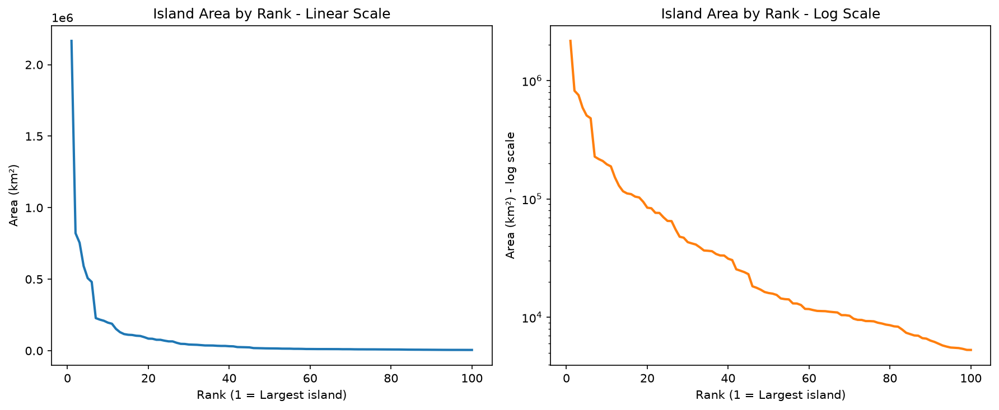

# Largest Islands in the World

An exploratory data analysis project using **Pandas** and **Matplotlib** to investigate the world's 100 largest islands. This project answers structured analytical questions related to island size, climate distribution, geographic regions, and international governance while practicing core data manipulation techniques in Python.

---

## Project Objectives

- Identify the ten largest tropical islands by area.
- Determine the largest island within each geographic region.
- Compare island area across global rankings using linear and logarithmic visualizations.
- Identify islands governed by multiple countries.
- Explore whether climate rankings differ when measured by island count versus total land area.

---

## Dataset

| Property | Value |
|----------|-------|
| Dataset | `largest-islands.csv` |
| Rows | 100 |
| Columns | 6 |
| Features | `region`, `island`, `area`, `countries`, `climate`, `rank` |
| Missing Values | 0 |
| Source | Visual Capitalist (2021), compiled from Britannica and Wikipedia |

---

## Technologies Used

- Python 3.12
- Pandas
- Matplotlib
- Jupyter Notebook

---

## Key Findings

- The **tropics** contain the largest number of islands in the dataset (**41** islands).
- Greenland dominates the dataset, being approximately **14× larger** than the 10th-ranked island, which compresses the remaining islands on a linear-scale chart.
- **7** islands are governed by multiple countries, with **Borneo** being shared by Indonesia, Malaysia, and Brunei.
- Climate rankings differ depending on the metric used. While the tropics rank first by both island count and total land area, the **temperate climate has more islands than the polar climate**, yet the **polar climate covers a much greater total area** because it contains exceptionally large islands such as Greenland.
- The dataset required **no data cleaning**, with zero missing values and consistent data types across all columns.

---

## Visualization

### Area by Global Rank



**Linear Scale:** Highlights Greenland as a significant outlier.

**Logarithmic Scale:** Reveals the underlying trend across all 100 islands after reducing the influence of the outlier.

---

## Project Structure

```
01-largest-islands/
│
├── README.md
├── notebook/
│   └── largest_islands.ipynb
├── data/
│   └── largest-islands.csv
└── images/
    └── plots/
        └── area_by_rank_line_chart.png
```

---

## Installation

Clone the repository.

```bash
git clone <repository-url>
```

Move into the repository.

```bash
cd data-science-portfolio
```

Activate the virtual environment.

### Windows

```powershell
venv\Scripts\activate
```

### macOS / Linux

```bash
source venv/bin/activate
```

Install the dependencies.

```bash
pip install -r requirements.txt
```

Launch Jupyter Notebook.

```bash
jupyter notebook
```

Open:

```
01-largest-islands/notebook/largest_islands.ipynb
```

---

## Learning Outcomes

This project demonstrates practical experience with:

- Reading CSV files using Pandas
- Data filtering and sorting
- GroupBy operations
- String-based filtering
- Exploratory data analysis
- Creating publication-quality visualizations
- Writing reproducible notebooks
