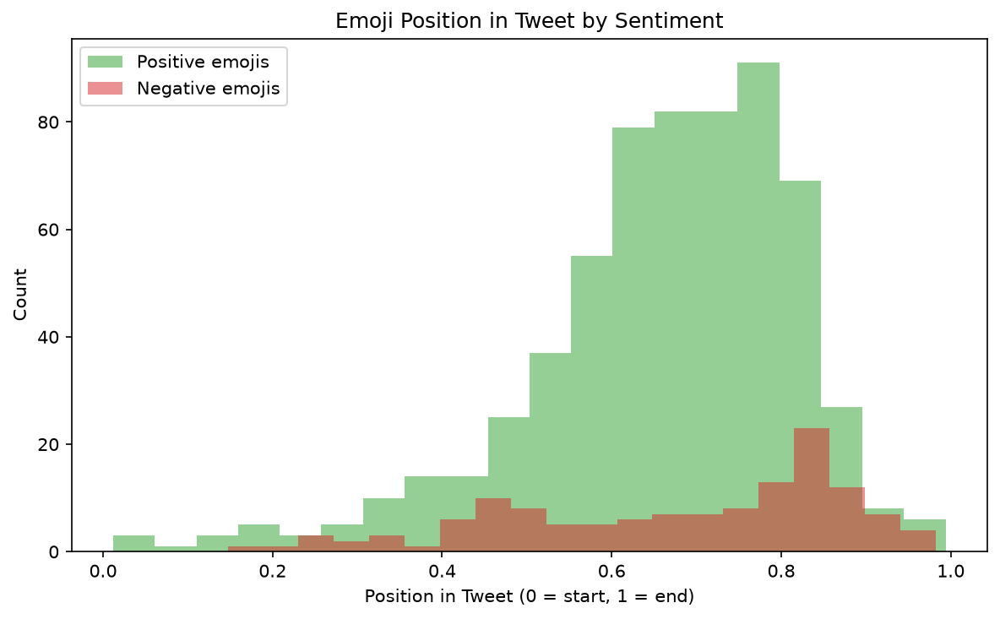
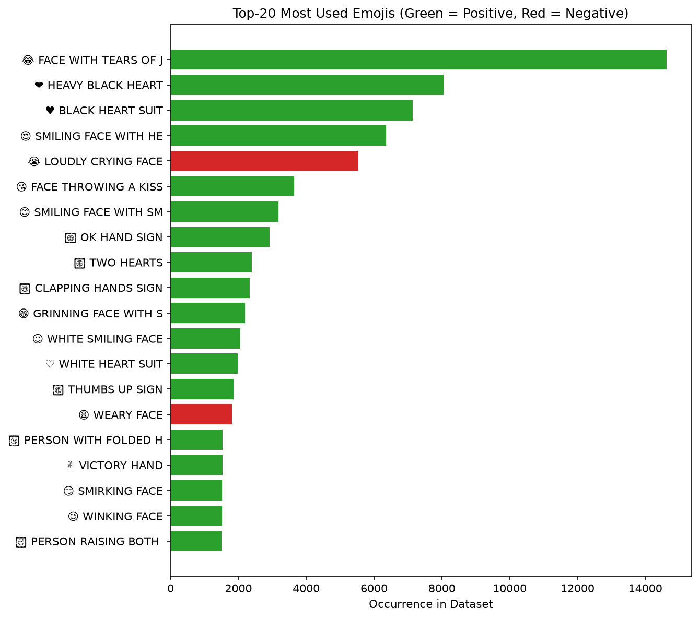
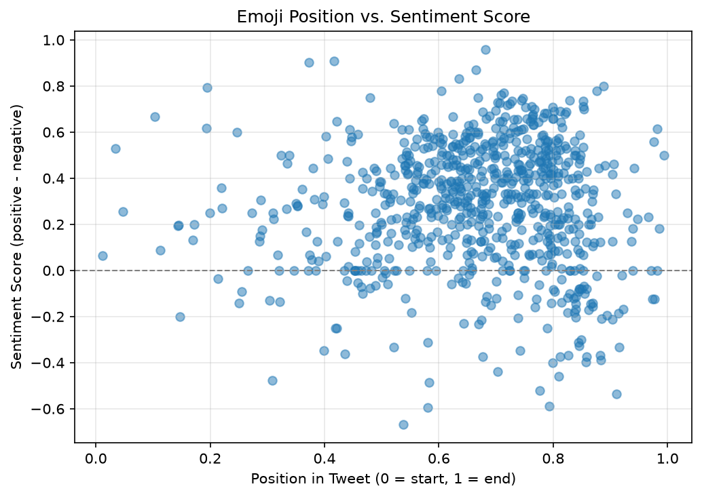
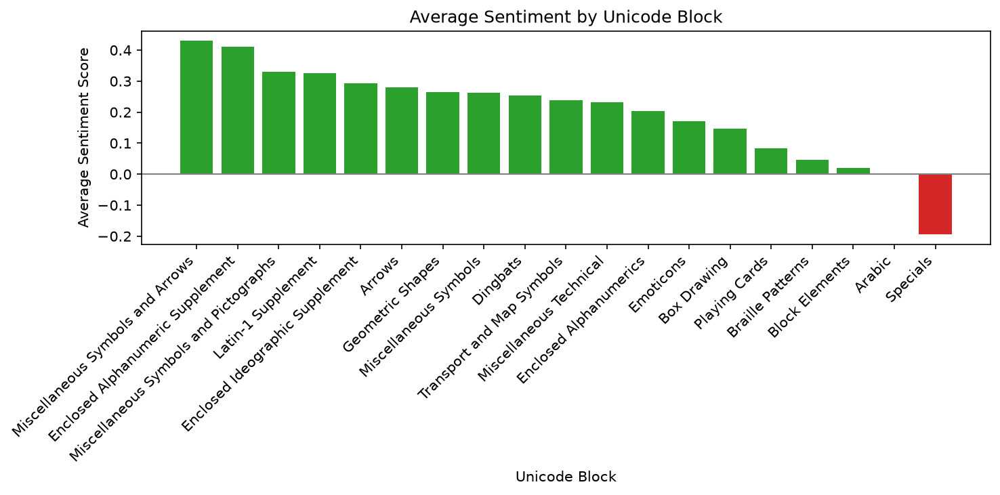

# Emoji Sentiment Analysis

**Project 2** of my **Data Science Portfolio**, developed while completing the **Cisco Networking Academy Data Science Essentials** course.

This project focuses on **data cleaning, feature engineering, and exploratory data analysis (EDA)** using an emoji sentiment dataset. The objective is to transform a messy dataset into an analysis-ready format and investigate how emoji popularity, sentiment, position, and Unicode categories relate to one another.

---

## Project Objectives

This project answers the following analytical questions:

1. What percentage of all emojis lean positive?
2. What percentage of the 20 most frequently used emojis are positive?
3. Which frequently used emojis have the highest and lowest sentiment?
4. Where do emojis typically appear within a tweet?
5. Does sentiment strength correlate with emoji position?
6. Are some Unicode emoji categories consistently more positive than others?

---

## Dataset

| Property | Value |
|----------|-------|
| File | `emoji-sentiment.csv` |
| Rows | 751 |
| Columns | 11 (8 after preprocessing) |
| Features | `emoji`, `occurrences`, `position`, `negative`, `neutral`, `positive`, `unicode_name`, `unicode_block` |
| Missing Values | One column contained only missing values and was removed |
| Source | Emoji Sentiment Ranking Dataset |

---

## Technologies Used

- Python 3.12.4
- Pandas
- Matplotlib
- Jupyter Notebook
- Git & GitHub

---

## Data Preprocessing

The raw dataset required preprocessing before analysis.

The following steps were performed:

- Removed one column containing **100% missing values**.
- Removed two technical columns that did not contribute to the analysis.
- Renamed all remaining columns using **snake_case** naming conventions.
- Created a new **sentiment** feature (`positive - negative`).
- Created a **positive_flag** feature to classify emojis as positive or negative.

---

## Key Findings

- **82.4%** of emojis in the dataset lean positive, indicating that positive sentiment is considerably more common than negative sentiment.

- The majority of the **20 most frequently used emojis** are also positive, suggesting that popularity and positivity generally move together.

- Filtering emojis with fewer than **500 occurrences** avoids misleading sentiment rankings caused by rare emojis with very small sample sizes.

- Emoji position shows **little to no relationship** with sentiment. Both the histogram and correlation analysis indicate that positive and negative emojis appear throughout tweets rather than at consistent positions.

- Unicode emoji categories exhibit different average sentiment scores, suggesting that some categories consistently express more positive sentiment than others.

---

## Visualizations

### Emoji Position by Sentiment



Compares the distribution of positive and negative emojis across tweet positions.

---

### Top 20 Most Used Emojis by Sentiment



Displays the twenty most frequently used emojis, colored according to their overall sentiment.

---

### Position vs. Sentiment Score



Shows the relationship between emoji position and sentiment score, illustrating the absence of a strong correlation.

---

### Average Sentiment by Unicode Block



Compares the average sentiment score across different Unicode emoji categories.

---

## Skills Demonstrated

This project demonstrates practical experience with:

- Data Cleaning
- Feature Engineering
- Exploratory Data Analysis (EDA)
- Pandas DataFrame manipulation
- Data filtering and sorting
- GroupBy aggregation
- Correlation analysis
- Creating derived features
- Data visualization using Matplotlib
- Markdown documentation
- Git version control
- GitHub project organization

---

## Project Structure

```text
02-emoji-sentiment/
│
├── README.md
├── notebook/
│   └── emoji_sentiment.ipynb
├── data/
│   └── emoji-sentiment.csv
└── images/
    └── plots/
        ├── position_by_sentiment_histogram.png
        ├── top20_emojis_by_sentiment.png
        ├── position_vs_sentiment_scatter.png
        └── sentiment_by_unicode_block.png
```

---

## Installation

Clone the repository.

```bash
git clone https://github.com/dakshita01/data-science-portfolio.git
```

Move into the repository.

```bash
cd data-science-portfolio
```

Activate the virtual environment.

### Windows

```powershell
venv\Scripts\activate
```

### macOS / Linux

```bash
source venv/bin/activate
```

Install the project dependencies.

```bash
pip install -r requirements.txt
```

Launch Jupyter Notebook.

```bash
jupyter notebook
```

Open:

```text
02-emoji-sentiment/notebook/emoji_sentiment.ipynb
```

---

## Learning Outcomes

Through this project, I strengthened my understanding of:

- Cleaning and preparing messy real-world datasets
- Engineering new analytical features
- Performing exploratory data analysis with Pandas
- Comparing distributions using statistical summaries
- Measuring relationships using correlation analysis
- Building informative visualizations with Matplotlib
- Documenting analytical findings clearly
- Organizing reproducible data science projects using Git and GitHub

---

## License

This project is part of my personal learning portfolio developed while completing the **Cisco Networking Academy Data Science Essentials** course.

The preprocessing, feature engineering, analysis, visualizations, and documentation are my own implementation based on the concepts learned throughout the course.