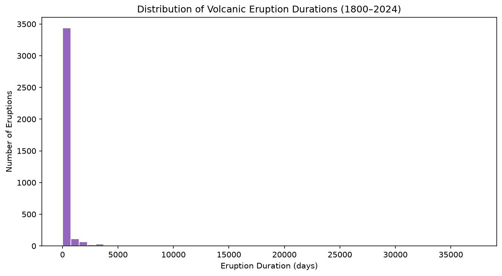
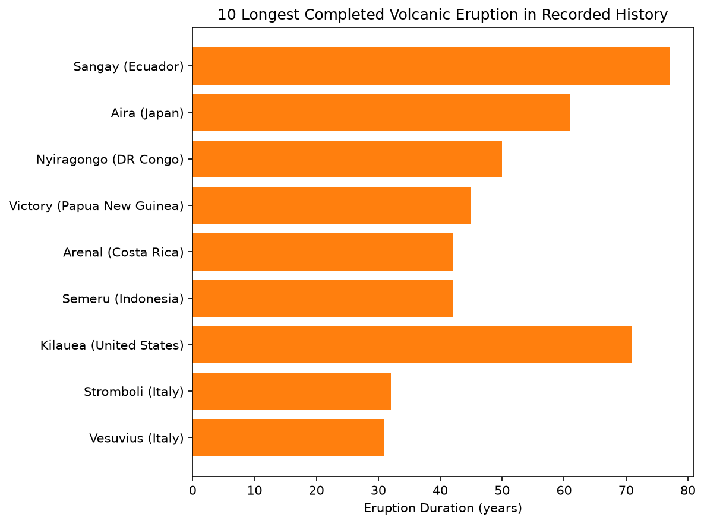

# Volcanic Eruptions Analysis

**Project 3** of my **Data Science Portfolio**, developed while completing the **Cisco Networking Academy Data Science Essentials** course.

This project focuses on **datetime parsing, feature engineering, data merging, and exploratory data analysis (EDA)** using historical volcanic eruption records. The objective is to combine eruption data with volcano information, calculate eruption durations, and investigate ongoing eruptions, historical eruption lengths, and eruption frequency.

---

## Project Objectives

This project answers the following analytical questions:

1. Which volcanoes were recorded as erupting at the time of the dataset's extraction?
2. Which volcanoes have had the longest recorded eruptions?
3. Which volcano has erupted the greatest number of times since 1800?

---

## Dataset

| Property | Value |
|----------|-------|
| Files | `volcanic-eruptions.csv`, `volcano-list.csv` |
| Eruption Records | 3,724 |
| Volcano Records | 1,281 |
| Key | `volcano_id` |
| Features Used | `volcano_id`, `start_date`, `end_date`, `volcano_name`, `country`, `primary_volcano_type` |
| Source | Smithsonian Global Volcanism Program Dataset |

---

## Technologies Used

- Python 3.12.4
- Pandas
- Matplotlib
- Jupyter Notebook
- Git & GitHub

---

## Data Preprocessing

The raw datasets required preprocessing before analysis.

The following steps were performed:

- Parsed the `start_date` and `end_date` columns into datetime format.
- Replaced the dataset's sentinel end date (`12-2024`) with a valid date for duration calculations.
- Created a new `duration_days` feature to calculate eruption length.
- Selected only the required columns from each dataset before merging.
- Merged eruption records with volcano information using `volcano_id`.
- Verified that all eruption records successfully matched a volcano after the merge.

---

## Key Findings

- As of the dataset's extraction in **December 2024**, **41 volcanoes** were still experiencing ongoing eruptions.

- The longest eruption durations differ depending on whether ongoing eruptions are included. Since active eruptions have no confirmed end date, their reported durations represent **lower-bound estimates** rather than final durations.

- The longest completed eruptions lasted for several decades, with **Sangay (Ecuador)** and **Kīlauea (United States)** recording the greatest confirmed durations in the dataset.

- **Fournaise, Piton de la** recorded the highest number of eruptions since 1800, demonstrating that eruption frequency and eruption duration measure different aspects of volcanic activity.

- Eruption durations are **highly right-skewed**, with most eruptions lasting relatively short periods while only a few continued for decades.

---

## Visualizations

### Distribution of Eruption Durations



Displays the distribution of eruption durations, showing that most eruptions were relatively short while a small number lasted for several decades.

---

### Ten Longest Completed Volcanic Eruptions



Compares the ten longest completed eruptions after converting eruption duration from days to years for easier interpretation.

---

## Skills Demonstrated

This project demonstrates practical experience with:

- Datetime Parsing
- Data Cleaning
- Feature Engineering
- Data Merging (Join Operations)
- Merge Validation
- Exploratory Data Analysis (EDA)
- Pandas DataFrame manipulation
- Data filtering and sorting
- GroupBy aggregation
- Creating derived features
- Data visualization using Matplotlib
- Markdown documentation
- Git version control
- GitHub project organization

---

## Project Structure

```text
03-volcanic-eruptions/
│
├── README.md
├── notebook/
│   └── volcanic_eruptions.ipynb
├── data/
│   ├── volcanic-eruptions.csv
│   └── volcano-list.csv
└── images/
    └── plots/
        ├── eruption_duration_distribution.png
        └── longest_completed_eruption_bar_chart.png
```

---

## Installation

Clone the repository.

```bash
git clone https://github.com/dakshita01/data-science-portfolio.git
```

Move into the repository.

```bash
cd data-science-portfolio
```

Activate the virtual environment.

### Windows

```powershell
venv\Scripts\activate
```

### macOS / Linux

```bash
source venv/bin/activate
```

Install the project dependencies.

```bash
pip install -r requirements.txt
```

Launch Jupyter Notebook.

```bash
jupyter notebook
```

Open:

```text
03-volcanic-eruptions/notebook/volcanic_eruptions.ipynb
```

---

## Learning Outcomes

Through this project, I strengthened my understanding of:

- Working with multiple related datasets
- Parsing and manipulating datetime data using Pandas
- Calculating durations through feature engineering
- Combining datasets using merge operations
- Validating merged datasets before analysis
- Exploring temporal data through visualizations
- Documenting analytical findings clearly
- Organizing reproducible data science projects using Git and GitHub

---

## License

This project is part of my personal learning portfolio developed while completing the **Cisco Networking Academy Data Science Essentials** course.

The preprocessing, feature engineering, analysis, visualizations, and documentation are my own implementation based on the concepts learned throughout the course.