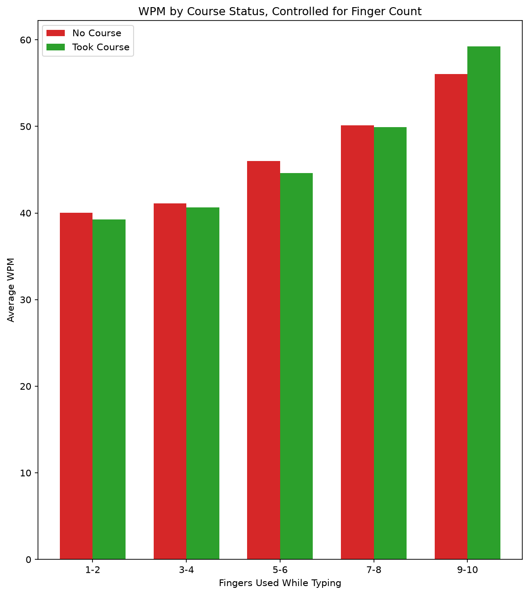

# Typing Speed Analysis

**Project 4** of my **Data Science Portfolio**, developed while completing the **Cisco Networking Academy Data Science Essentials** course.

This project focuses on **data cleaning, exploratory data analysis (EDA), grouped aggregation, and identifying confounding variables** using an online typing test dataset. The objective is to investigate whether taking a typing course is associated with faster typing speed while demonstrating how controlling for a confounding variable can change analytical conclusions.

---

## Project Objectives

This project answers the following analytical questions:

1. Do people who have taken a typing course type faster on average?
2. Is finger count a confounding variable in this comparison?
3. How does typing speed vary by finger count, keyboard type, and keyboard layout?
4. How much of the naive typing speed gap remains after controlling for finger count?

---

## Dataset

| Property | Value |
|----------|-------|
| File | `typing_data.csv` |
| Original Rows | 168,595 |
| Rows After Cleaning | 168,574 |
| Features Used | `AGE`, `COUNTRY`, `AVG_WPM_15`, `HAS_TAKEN_TYPING_COURSE`, `FINGERS`, `KEYBOARD_TYPE`, `LAYOUT` |
| Source | Typing Speed Dataset |

---

## Technologies Used

- Python 3.12.4
- Pandas
- Numpy
- Matplotlib
- Jupyter Notebook
- Git & GitHub

---

## Data Preprocessing

The raw dataset required preprocessing before analysis.

The following steps were performed:

- Removed records with implausible ages (outside 5–95 years).
- Removed rows with missing `COUNTRY` values.
- Verified the proportion of removed records before continuing the analysis.
- Created grouped summaries to compare typing speed across multiple categories.
- Calculated the typing speed gap before and after controlling for finger count.

---

## Key Findings

- A naive comparison suggests that participants who completed a typing course type approximately **5.36 WPM** faster on average.

- After controlling for **finger count**, the average difference decreases substantially, showing that much of the observed gap is explained by typing technique rather than course participation.

- Among the finger-count groups with sufficient data, participants using **9–10 fingers** achieved the highest average typing speeds regardless of course status.

- The **10+ finger** category contained only a single observation and was excluded from interpretation.

- This project demonstrates how aggregated averages can produce misleading conclusions when important confounding variables are ignored.

---

## Visualizations

### Typing Speed by Course Status (Controlled for Finger Count)



Compares the average typing speed of participants who did and did not take a typing course within each finger-count group, illustrating the effect of controlling for a confounding variable.

---

## Skills Demonstrated

This project demonstrates practical experience with:

- Data Cleaning
- Exploratory Data Analysis (EDA)
- GroupBy aggregation
- Multi-level grouping
- Confounding variable analysis
- Comparative data analysis
- Creating derived metrics
- Data visualization using Matplotlib
- Statistical reasoning
- Markdown documentation
- Git version control
- GitHub project organization

---

## Project Structure

```text
04-typing-speeds/
│
├── README.md
├── notebook/
│   └── typing_speed_analysis.ipynb
├── data/
│   └── typing_data.csv
└── images/
    └── plots/
        └── wpm_by_course_controlled_for_fingers.png
```

---

## Installation

Clone the repository.

```bash
git clone https://github.com/dakshita01/data-science-portfolio.git
```

Move into the repository.

```bash
cd data-science-portfolio
```

Activate the virtual environment.

### Windows

```powershell
venv\Scripts\activate
```

### macOS / Linux

```bash
source venv/bin/activate
```

Install the project dependencies.

```bash
pip install -r requirements.txt
```

Launch Jupyter Notebook.

```bash
jupyter notebook
```

Open:

```text
04-typing-speeds/notebook/typing_speed_analysis.ipynb
```

---

## Learning Outcomes

Through this project, I strengthened my understanding of:

- Cleaning and validating large real-world datasets
- Comparing groups using Pandas aggregations
- Identifying and controlling for confounding variables
- Interpreting subgroup analyses instead of relying on overall averages
- Building comparative visualizations with Matplotlib
- Communicating analytical findings through clear documentation
- Organizing reproducible data science projects using Git and GitHub

---

## License

This project is part of my personal learning portfolio developed while completing the **Cisco Networking Academy Data Science Essentials** course.

The preprocessing, analysis, visualizations, and documentation are my own implementation based on the concepts learned throughout the course.