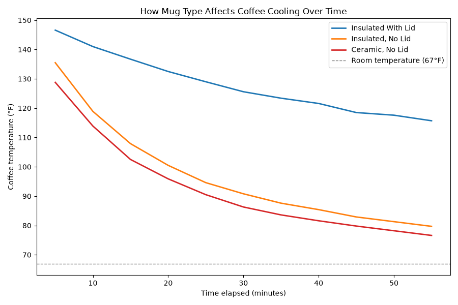
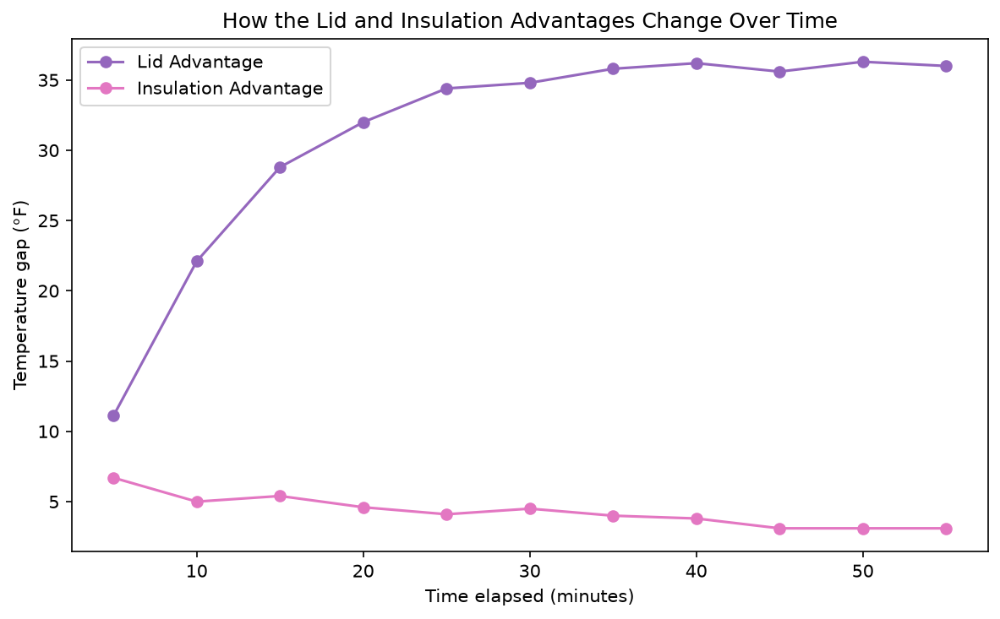

# Coffee Cooling Analysis

**Project 5** of my **Data Science Portfolio**, developed while completing the **Cisco Networking Academy Data Science Essentials** course.

This project focuses on **data visualization, comparative analysis, and feature engineering** using a controlled coffee cooling experiment. The objective is to compare how different mug types affect coffee temperature over time while demonstrating techniques for creating clear and informative visualizations.

---

## Project Objectives

This project answers the following analytical questions:

1. How does coffee temperature change over time for different mug types?
2. How can visualization design improve the communication of data?
3. How much additional heat retention does a lid provide compared to insulation alone?
4. How do the temperature differences between mug types change throughout the experiment?

---

## Dataset

| Property | Value |
|----------|-------|
| File | `hot-coffee.csv` |
| Rows | 11 |
| Columns | 4 |
| Features | `time`, `insulated with lid`, `insulated`, `ceramic` |
| Missing Values | None |
| Source | Cisco Networking Academy Coffee Cooling Dataset |

---

## Technologies Used

- Python 3.12.4
- Pandas
- Matplotlib
- Jupyter Notebook
- Git & GitHub

---

## Data Preprocessing

The dataset required minimal preprocessing before analysis.

The following steps were performed:

- Verified the dataset structure and data types.
- Confirmed that all columns contained numeric values.
- Verified that no missing values were present.
- Created two derived features:
  - `lid_vs_no_lid_gap`
  - `insulated_vs_ceramic`
- Used the derived features to compare temperature differences throughout the experiment.

---

## Key Findings

- The insulated mug with a lid retained the highest temperature throughout the experiment, while the ceramic mug cooled the fastest.

- After **55 minutes**, the lid provided a much greater heat-retention advantage (**36.0°F**) than insulation alone (**3.1°F**).

- The temperature advantage of using a lid increased over time, whereas the insulation advantage over the ceramic mug remained relatively small.

- No preprocessing was required because the dataset contained only numeric values and no missing data.

---

## Visualizations

### Coffee Cooling Curves



Shows how coffee temperature changes over time for each mug type, including a reference line representing room temperature.

---

### Temperature Gap Over Time



Compares how the temperature advantages provided by a lid and insulation evolve throughout the cooling experiment.

---

## Skills Demonstrated

This project demonstrates practical experience with:

- Exploratory Data Analysis (EDA)
- Feature Engineering
- Comparative Analysis
- Time-Series Visualization
- Line Chart Design
- Plot Annotation
- Direct Line Labeling
- Pandas DataFrame manipulation
- Matplotlib customization
- Data storytelling
- Markdown documentation
- Git version control
- GitHub project organization

---

## Project Structure

```text
05-cooling-coffee/
│
├── README.md
├── notebook/
│   └── cooling_coffee.ipynb
├── data/
│   └── hot-coffee.csv
└── images/
    └── plots/
        ├── coffee_cooling_curves.png
        └── temperature_gap_over_time.png
```

---

## Installation

Clone the repository.

```bash
git clone https://github.com/dakshita01/data-science-portfolio.git
```

Move into the repository.

```bash
cd data-science-portfolio
```

Activate the virtual environment.

### Windows

```powershell
venv\Scripts\activate
```

### macOS / Linux

```bash
source venv/bin/activate
```

Install the project dependencies.

```bash
pip install -r requirements.txt
```

Launch Jupyter Notebook.

```bash
jupyter notebook
```

Open:

```text
05-cooling-coffee/notebook/cooling_coffee.ipynb
```

---

## Learning Outcomes

Through this project, I strengthened my understanding of:

- Designing clear and informative data visualizations
- Comparing multiple time-series measurements
- Engineering new analytical features
- Communicating findings through effective chart design
- Applying Matplotlib customization techniques
- Supporting visual observations with quantitative summaries
- Organizing reproducible data science projects using Git and GitHub

---

## License

This project is part of my personal learning portfolio developed while completing the **Cisco Networking Academy Data Science Essentials** course.

The analysis, feature engineering, visualizations, and documentation are my own implementation based on the concepts learned throughout the course.