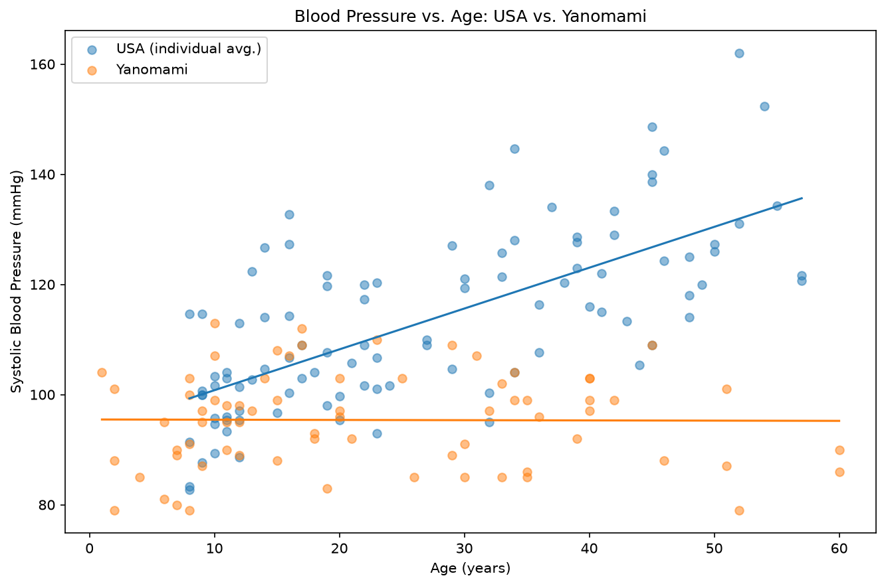

# Blood Pressure and Age Analysis

**Project 7** of my **Data Science Portfolio**, developed while completing the **Cisco Networking Academy Data Science Essentials** course.

This project focuses on **feature engineering, linear regression, comparative analysis, and model interpretation** using blood pressure measurements from two populations. The objective is to compare how blood pressure changes with age in the USA and Yanomami populations while demonstrating the importance of distinguishing correlation from causation.

---

## Project Objectives

This project answers the following analytical questions:

1. How does blood pressure change with age in the USA and Yanomami populations?
2. How well does a linear regression model describe each population?
3. How do the fitted models compare in terms of slope and R²?
4. What conclusions can and cannot be drawn about salt intake from this comparison?

---

## Dataset

| Property | Value |
|----------|-------|
| Files | `blood-pressure-usa.csv`, `blood-pressure-yanomami.csv` |
| USA Participants | 100 |
| Yanomami Participants | 71 |
| Features Used | `age`, `bp1`, `bp2`, `bp3`, `bp_avg`, `bp` |
| Missing Values | None |
| Source | Cisco Networking Academy Blood Pressure Dataset |

---

## Technologies Used

- Python 3.12.4
- Pandas
- Matplotlib
- Scikit-learn (via the provided `LinearModel` class)
- Jupyter Notebook
- Git & GitHub

---

## Data Preprocessing

The datasets required minimal preprocessing before analysis.

The following steps were performed:

- Verified the structure and data types of both datasets.
- Confirmed that no missing values were present.
- Created a new `bp_avg` feature by averaging the three blood pressure readings for each USA participant.
- Used the averaged readings to ensure one observation per participant before fitting the regression model.

---

## Methodology

Separate linear regression models were fitted for the USA and Yanomami populations.

Model performance was evaluated using the **regression slope** and **R² (coefficient of determination)**, allowing both the strength of the age-related trend and the goodness of fit to be compared between the two populations.

---

## Key Findings

- The **USA** population showed a clear positive relationship between age and blood pressure (**slope ≈ 0.74 mmHg/year**, **R² ≈ 0.47**).

- The **Yanomami** population showed almost no relationship between age and blood pressure (**slope ≈ −0.004**, **R² ≈ 0.0001**).

- The observed difference is **consistent with** the salt-intake hypothesis but does **not** establish causation because other confounding variables were not controlled.

- Averaging the three USA measurements before modeling ensured one independent observation per participant.

- The Yanomami dataset contains only one measurement per participant, making those observations inherently noisier than the averaged USA measurements.

---

## Visualization

### Blood Pressure vs. Age: USA vs. Yanomami



Compares both populations on the same axes using fitted linear regression models, enabling an honest comparison of age-related blood pressure trends.

---

## Skills Demonstrated

This project demonstrates practical experience with:

- Exploratory Data Analysis (EDA)
- Feature Engineering
- Linear Regression
- Model Interpretation
- Comparative Analysis
- Regression Evaluation
- Correlation vs. Causation
- Confounding Variable Analysis
- Pandas DataFrame manipulation
- Matplotlib visualization
- Statistical reasoning
- Markdown documentation
- Git version control
- GitHub project organization

---

## Project Structure

```text
07-blood-pressure-age/
│
├── README.md
├── notebook/
│   └── blood_pressure_age.ipynb
├── data/
│   ├── blood-pressure-usa.csv
│   └── blood-pressure-yanomami.csv
├── src/
│   └── linear_model.py
└── images/
    └── plots/
        └── bp_vs_age_both_populations.png
```

---

## Installation

Clone the repository.

```bash
git clone https://github.com/dakshita01/data-science-portfolio.git
```

Move into the repository.

```bash
cd data-science-portfolio
```

Activate the virtual environment.

### Windows

```powershell
venv\Scripts\activate
```

### macOS / Linux

```bash
source venv/bin/activate
```

Install the project dependencies.

```bash
pip install -r requirements.txt
```

Launch Jupyter Notebook.

```bash
jupyter notebook
```

Open:

```text
07-blood-pressure-age/notebook/blood_pressure_age.ipynb
```

---

## Learning Outcomes

Through this project, I strengthened my understanding of:

- Averaging repeated measurements before statistical modeling
- Fitting and interpreting linear regression models
- Comparing regression models across different populations
- Understanding slope and R² as model evaluation metrics
- Distinguishing correlation from causation
- Identifying potential confounding variables in observational studies
- Communicating statistical findings through effective visualizations
- Organizing reproducible data science projects using Git and GitHub

---

## License

This project is part of my personal learning portfolio developed while completing the **Cisco Networking Academy Data Science Essentials** course.

The preprocessing, feature engineering, analysis, visualizations, and documentation are my own implementation based on the concepts learned throughout the course.