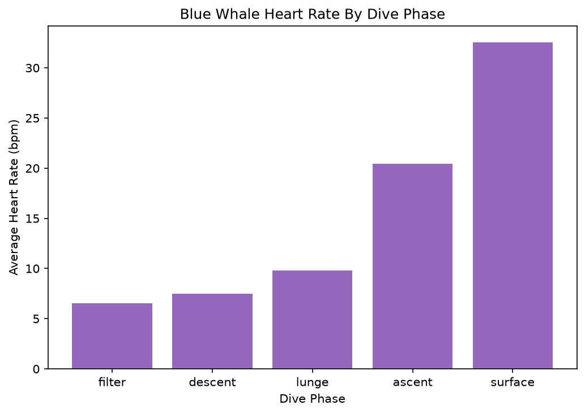
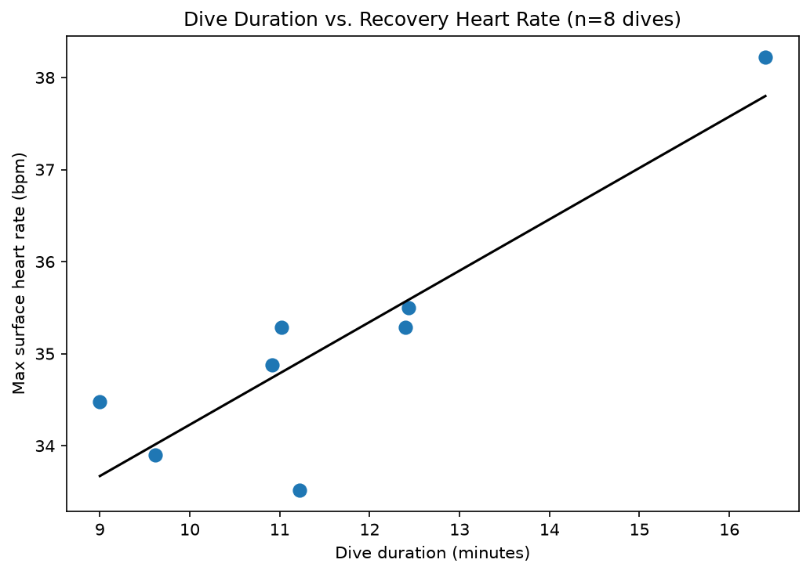

# Whale Heart Rates Analysis

**Project 8** of my **Data Science Portfolio**, developed while completing the **Cisco Networking Academy Data Science Essentials** course.

This project focuses on **time-series feature engineering, missing data analysis, grouped aggregation, and linear regression** using blue whale biologging data. The objective is to investigate how heart rate changes throughout different dive phases and whether longer dives are associated with higher recovery heart rates after surfacing.

---

## Project Objectives

This project answers the following analytical questions:

1. How does average heart rate vary across different dive phases?
2. Does a longer dive duration predict a higher maximum surface heart rate?
3. How can raw timestamp data be transformed into dive-level features for regression modeling?
4. Is missing heart-rate data evenly distributed across dive phases?

---

## Dataset

| Property | Value |
|----------|-------|
| File | `blue-whale-heart-rates.csv` |
| Rows | 1,087 |
| Dives | 8 |
| Features | `timestamp`, `heart_rate`, `dive_id`, `dive_phase` |
| Missing Heart Rate Values | 357 (32.8%) |
| Source | Cisco Networking Academy Blue Whale Biologging Dataset |

---

## Technologies Used

- Python 3.12.4
- Pandas
- Matplotlib
- Scikit-learn (via the provided `LinearModel` class)
- Jupyter Notebook
- Git & GitHub

---

## Data Preprocessing

The dataset required preprocessing and feature engineering before analysis.

The following steps were performed:

- Verified the dataset structure and quantified missing values.
- Examined heart-rate missingness across dive phases before computing phase-level averages.
- Parsed timestamp strings into Pandas datetime objects using an explicit datetime format.
- Calculated dive duration using the earliest descent timestamp and latest ascent timestamp for each dive.
- Computed the maximum surface heart rate for every dive.
- Merged the engineered dive-level features into a single modeling dataset.

---

## Methodology

The analysis was completed in two stages.

First, average heart rate was calculated for each dive phase to understand how the whale's physiology changes throughout a dive.

Next, raw timestamp data were transformed into dive-level features. A linear regression model was then fitted using **dive duration** as the predictor and **maximum surface heart rate** as the response variable.

Model performance was evaluated using the **regression slope** and **R² (coefficient of determination)** while explicitly acknowledging the small sample size (**n = 8 dives**).

---

## Key Findings

- Heart rate was lowest during the **filter phase (≈6.6 bpm)** and highest during the **surface phase (≈32.5 bpm)**.

- A positive relationship was observed between dive duration and maximum surface heart rate (**slope ≈ 0.56 bpm/min**, **R² ≈ 0.78**), although the regression model was fitted using only **8 dives**.

- Approximately **32.8%** of the heart-rate measurements were missing, making it important to evaluate missingness before interpreting phase-level averages.

- Multi-step feature engineering transformed raw timestamp measurements into meaningful dive-level variables suitable for regression analysis.

---

## Visualizations

### Average Heart Rate by Dive Phase



Compares the whale's average heart rate across the five dive phases, highlighting substantial physiological differences throughout the dive cycle.

---

### Dive Duration vs. Maximum Surface Heart Rate



Shows the relationship between dive duration and maximum recovery heart rate after surfacing together with the fitted linear regression model.

---

## Skills Demonstrated

This project demonstrates practical experience with:

- Exploratory Data Analysis (EDA)
- Missing Data Analysis
- Time-Series Feature Engineering
- Datetime Parsing
- GroupBy aggregation
- Data Merging
- Linear Regression
- Model Interpretation
- Pandas DataFrame manipulation
- Matplotlib visualization
- Statistical reasoning
- Markdown documentation
- Git version control
- GitHub project organization

---

## Project Structure

```text
08-whale-heart-rates/
│
├── README.md
├── notebook/
│   └── whale_heart_rates.ipynb
├── data/
│   └── blue-whale-heart-rates.csv
├── src/
│   └── linear_model.py
└── images/
    └── plots/
        ├── heart_rate_by_dive_phase.png
        └── dive_duration_vs_surface_hr.png
```

---

## Installation

Clone the repository.

```bash
git clone https://github.com/dakshita01/data-science-portfolio.git
```

Move into the repository.

```bash
cd data-science-portfolio
```

Activate the virtual environment.

### Windows

```powershell
venv\Scripts\activate
```

### macOS / Linux

```bash
source venv/bin/activate
```

Install the project dependencies.

```bash
pip install -r requirements.txt
```

Launch Jupyter Notebook.

```bash
jupyter notebook
```

Open:

```text
08-whale-heart-rates/notebook/whale_heart_rates.ipynb
```

---

## Learning Outcomes

Through this project, I strengthened my understanding of:

- Engineering analytical features from raw time-series data
- Parsing and manipulating datetime values using Pandas
- Building multi-step data transformation pipelines
- Evaluating missing data before statistical analysis
- Fitting and interpreting linear regression models
- Understanding how sample size influences model reliability
- Communicating analytical findings through effective visualizations
- Organizing reproducible data science projects using Git and GitHub

---

## Limitations

- The regression model was fitted using only **8 dives**, so the reported slope and **R²** should be interpreted cautiously.

- Approximately **32.8%** of the heart-rate measurements were missing. Missingness was examined before analysis to better understand its potential impact on the phase-level summaries.

---

## License

This project is part of my personal learning portfolio developed while completing the **Cisco Networking Academy Data Science Essentials** course.

The preprocessing, feature engineering, analysis, visualizations, and documentation are my own implementation based on the concepts learned throughout the course.