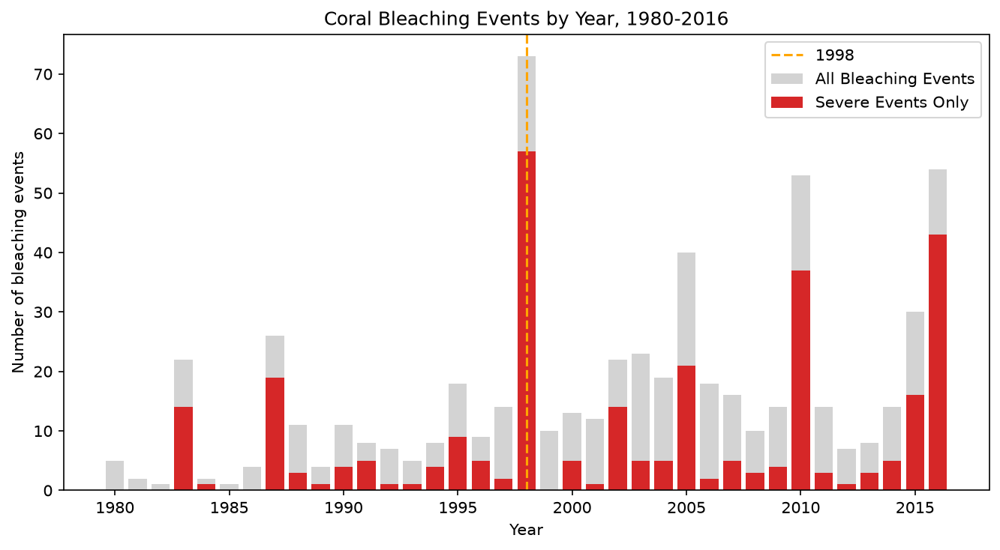
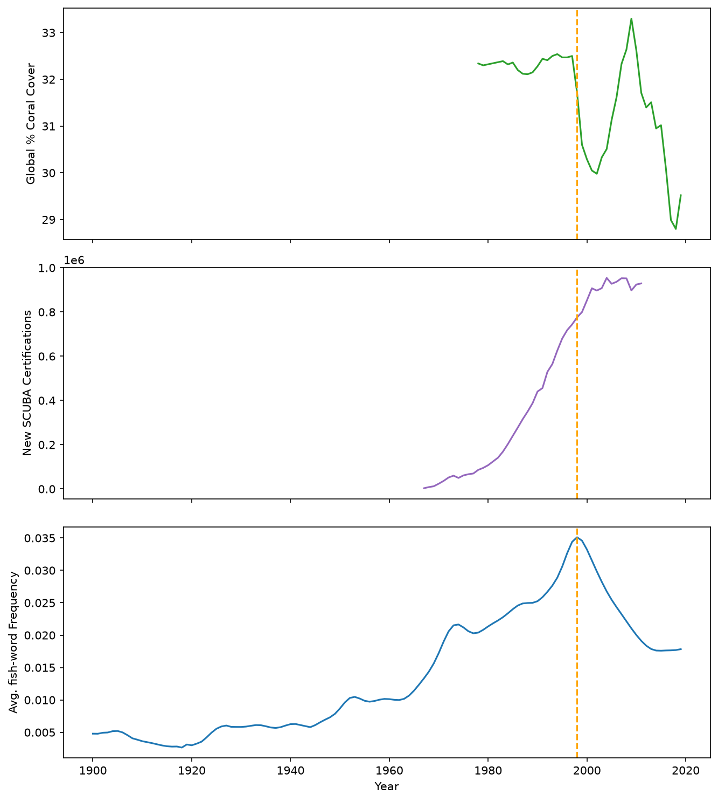
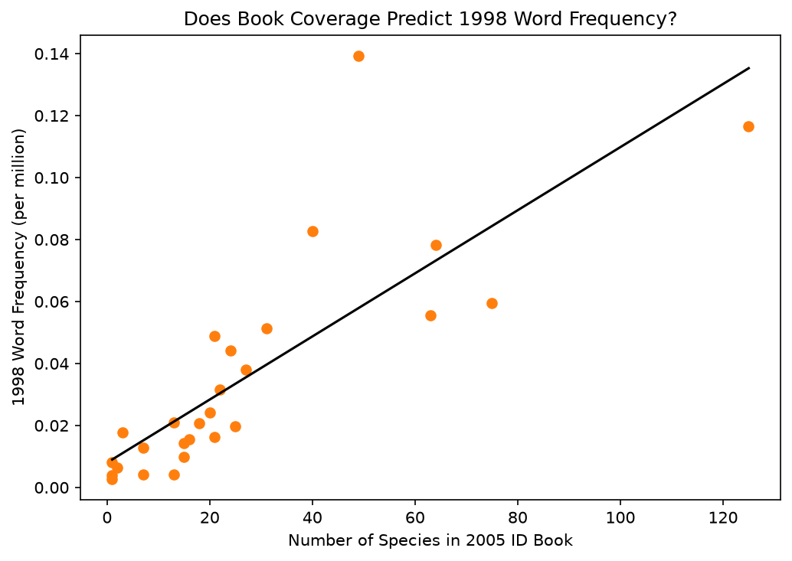

# Coral Conundrum Analysis

**Project 9** of my **Data Science Portfolio**, developed while completing the **Cisco Networking Academy Data Science Essentials** course.

This project focuses on **data cleaning, time-series analysis, comparative visualization, feature engineering, and linear regression** using multiple coral reef datasets. The objective is to investigate the decline in reef fish word frequency after 1998 by evaluating multiple competing explanations through evidence-based analysis.

---

## Project Objectives

This project answers the following analytical questions:

1. Does the decline in reef fish word frequency coincide with major coral bleaching events?
2. How do coral cover, SCUBA certifications, and reef fish word frequency change over time?
3. Does identification book coverage help explain differences in fish word frequency?
4. Can multiple competing hypotheses better explain the observed decline than a single mechanism?

---

## Dataset

| Property | Value |
|----------|-------|
| Files | `reef-fish-words.csv`, `bleaching-reefs.csv`, `global-coral-cover.csv`, `scuba-certifications.csv`, `reef-fish-id-books.csv` |
| Features Used | `year`, `word`, `frequency`, `severity`, `percent_coral`, `num_new_certifications`, `num_species_in_book` |
| Missing Values | None after cleaning |
| Source | Cisco Networking Academy Coral Reef Datasets |

---

## Technologies Used

- Python 3.12.4
- Pandas
- Matplotlib
- Scikit-learn (via the provided `LinearModel` class)
- Jupyter Notebook
- Git & GitHub

---

## Data Preprocessing

The datasets required cleaning and feature engineering before analysis.

The following steps were performed:

- Verified the structure of all datasets and checked for missing values.
- Standardized bleaching severity labels before calculating yearly event counts.
- Aggregated reef fish word frequencies by year for trend analysis.
- Merged 1998 word-frequency data with reef fish identification book coverage.
- Prepared the merged dataset for linear regression modeling.

---

## Methodology

The analysis evaluated three competing mechanisms that might explain the decline in reef fish word frequency after 1998.

First, yearly bleaching events were compared with long-term trends in coral cover, SCUBA certifications, and average reef fish word frequency using time-series visualizations.

Next, a linear regression model was fitted to examine whether the number of species included in reef fish identification books predicted fish word frequency in 1998.

Finally, an alternative publishing-related explanation was considered to demonstrate how multiple plausible hypotheses should be evaluated before drawing conclusions.

---

## Key Findings

- Reef fish word frequency declined substantially after **1998**, coinciding with increasing coral bleaching events and declining coral cover.

- Identification book coverage showed a **moderately strong positive relationship** with 1998 word frequency (**R² ≈ 0.66**), suggesting that educational exposure may partially influence public familiarity with reef fish.

- No single mechanism fully explains the observed decline. The available evidence suggests that multiple factors—including reef degradation, educational exposure, and broader publishing trends—likely contributed together.

- This project emphasizes evaluating competing hypotheses and distinguishing evidence-supported conclusions from speculative explanations.

---

## Visualizations

### Coral Bleaching Events by Year



Shows the yearly number of recorded coral bleaching events while highlighting severe bleaching events and the pivotal year **1998**.

---

### Comparing Long-Term Trends



Compares coral cover, SCUBA certifications, and average reef fish word frequency on a shared timeline to investigate whether changes around 1998 occur simultaneously.

---

### Book Coverage vs. Word Frequency



Examines whether reef fish appearing in more identification books tend to have higher word frequencies using a fitted linear regression model.

---

## Skills Demonstrated

This project demonstrates practical experience with:

- Exploratory Data Analysis (EDA)
- Data Cleaning
- Feature Engineering
- Time-Series Analysis
- Comparative Visualization
- Data Integration
- Linear Regression
- Model Interpretation
- Hypothesis Evaluation
- Pandas DataFrame manipulation
- Matplotlib visualization
- Statistical reasoning
- Markdown documentation
- Git version control
- GitHub project organization

---

## Project Structure

```text
09-coral-conundrum/
│
├── README.md
├── notebook/
│   └── coral_conundrum.ipynb
├── data/
│   ├── reef-fish-words.csv
│   ├── bleaching-reefs.csv
│   ├── global-coral-cover.csv
│   ├── scuba-certifications.csv
│   └── reef-fish-id-books.csv
├── src/
│   └── linear_model.py
└── images/
    └── plots/
        ├── bleaching_events_by_year.png
        ├── three_panel_cooccurrence.png
        └── book_coverage_vs_frequency.png
```

---

## Installation

Clone the repository.

```bash
git clone https://github.com/dakshita01/data-science-portfolio.git
```

Move into the repository.

```bash
cd data-science-portfolio
```

Activate the virtual environment.

### Windows

```powershell
venv\Scripts\activate
```

### macOS / Linux

```bash
source venv/bin/activate
```

Install the project dependencies.

```bash
pip install -r requirements.txt
```

Launch Jupyter Notebook.

```bash
jupyter notebook
```

Open:

```text
09-coral-conundrum/notebook/coral_conundrum.ipynb
```

---

## Learning Outcomes

Through this project, I strengthened my understanding of:

- Cleaning and integrating multiple datasets for analysis
- Comparing long-term trends using time-series visualizations
- Building and interpreting linear regression models
- Evaluating multiple competing hypotheses using available evidence
- Distinguishing correlation from causal explanations
- Communicating analytical findings through effective visualizations
- Organizing reproducible data science projects using Git and GitHub

---

## Limitations

- The proposed mechanisms are evaluated using observational data and should not be interpreted as establishing causation.

- The identification book analysis provides indirect evidence and does not fully explain the observed decline in reef fish word frequency.

- The alternative publishing explanation is presented as a plausible hypothesis but cannot be directly tested using the available datasets.

---

## License

This project is part of my personal learning portfolio developed while completing the **Cisco Networking Academy Data Science Essentials** course.

The preprocessing, feature engineering, analysis, visualizations, and documentation are my own implementation based on the concepts learned throughout the course.