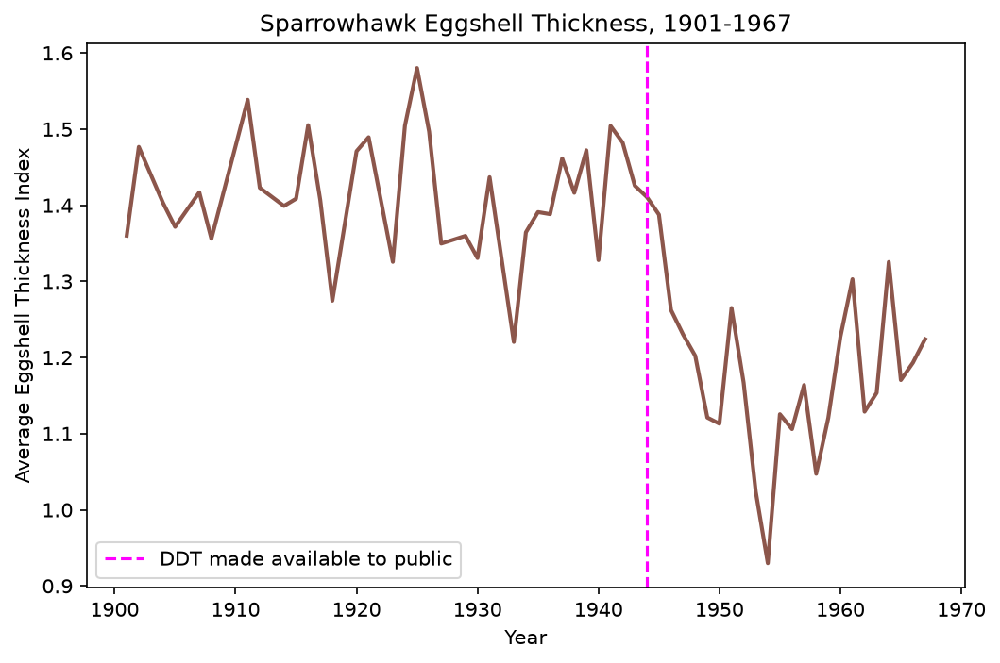
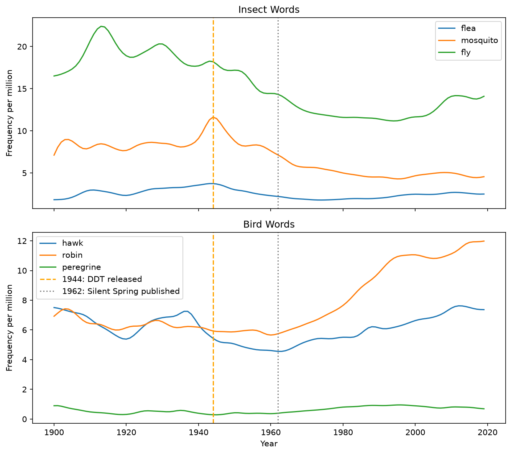

# Silent Spring Analysis

**Project 10** of my **Data Science Portfolio**, developed while completing the **Cisco Networking Academy Data Science Essentials** course.

This project focuses on **historical data analysis, time-series visualization, comparative analysis, and evidence-based interpretation** using historical word-frequency trends and ecological measurements. The objective is to investigate the environmental impact of DDT and the influence of *Silent Spring* by combining ecological evidence with changes in public discourse while carefully distinguishing correlation from historical interpretation.

---

## Project Objectives

This project answers the following analytical questions:

1. How did insect word frequencies change around the introduction of DDT in 1944?
2. Does sparrowhawk eggshell thickness support the claim that DDT was harmless to non-insect animals?
3. How did bird word frequencies change following the publication of *Silent Spring* in 1962?
4. What conclusions can be drawn by combining ecological measurements with historical word-frequency trends?

---

## Dataset

| Property | Value |
|----------|-------|
| Files | `animal-word-trends-silent-spring.csv`, `sparrowhawk-eggshell-data.csv` |
| Word Trend Records | 1,320 |
| Eggshell Measurements | 58 |
| Features Used | `year`, `word`, `frequency`, `avg_thickness` |
| Missing Values | None |
| Source | Cisco Networking Academy Silent Spring Datasets |

---

## Technologies Used

- Python 3.12.4
- Pandas
- Matplotlib
- Jupyter Notebook
- Git & GitHub

---

## Data Preprocessing

The datasets required minimal preprocessing before analysis.

The following steps were performed:

- Verified the structure and completeness of both datasets.
- Built reusable plotting functions for insect and bird word trends.
- Calculated average eggshell thickness before and after 1944.
- Computed the percentage decline in eggshell thickness following the introduction of DDT.
- Compared average bird word frequencies before and after 1962.

---

## Methodology

The analysis follows a chronological historical narrative.

First, insect word-frequency trends were examined around **1944**, when DDT became publicly available, to investigate whether public discussion changed following its introduction.

Next, sparrowhawk eggshell thickness measurements were compared before and after **1944** to evaluate whether the ecological evidence was consistent with the historical claim that DDT was harmless to non-insect animals.

Finally, bird word frequencies were examined around **1962**, when *Silent Spring* was published, to distinguish changes in public attention from changes in wildlife populations.

---

## Key Findings

- No clear shift in insect word frequency occurred immediately after **1944**. Most insect words continued their existing long-term trends.

- Average sparrowhawk eggshell thickness declined by approximately **16.4%** after **1944**, providing evidence consistent with the documented ecological impact of DDT on birds of prey.

- All six bird words increased in average frequency after **1962**, suggesting increased public discussion following the publication of *Silent Spring* rather than evidence of recovering bird populations.

- Word frequency reflects **public attention**, not population size. Historical text trends should therefore be interpreted differently from ecological measurements.

- Together, the datasets suggest that ecological impacts associated with DDT became evident before widespread public awareness, illustrating the difference between environmental change and public discourse.

---

## Visualizations

### Sparrowhawk Eggshell Thickness Decline



Compares average sparrowhawk eggshell thickness before and after the introduction of DDT, illustrating the gradual decline observed in the ecological data.

---

### Insect vs. Bird Word Trends



Compares insect and bird word frequencies on a shared timeline while highlighting the historical milestones of **1944** (DDT introduction) and **1962** (*Silent Spring* publication).

---

## Skills Demonstrated

This project demonstrates practical experience with:

- Exploratory Data Analysis (EDA)
- Historical Data Analysis
- Time-Series Analysis
- Comparative Analysis
- Before-and-After Comparison
- Percentage Change Calculation
- Evidence-Based Interpretation
- Scientific Storytelling
- Pandas DataFrame manipulation
- Matplotlib visualization
- Markdown documentation
- Git version control
- GitHub project organization

---

## Project Structure

```text
10-silent-spring/
│
├── README.md
├── notebook/
│   └── silent_spring.ipynb
├── data/
│   ├── animal-word-trends-silent-spring.csv
│   └── sparrowhawk-eggshell-data.csv
└── images/
    └── plots/
        ├── eggshell_thickness_decline.png
        └── insect_vs_bird_comparison.png
```

---

## Installation

Clone the repository.

```bash
git clone https://github.com/dakshita01/data-science-portfolio.git
```

Move into the repository.

```bash
cd data-science-portfolio
```

Activate the virtual environment.

### Windows

```powershell
venv\Scripts\activate
```

### macOS / Linux

```bash
source venv/bin/activate
```

Install the project dependencies.

```bash
pip install -r requirements.txt
```

Launch Jupyter Notebook.

```bash
jupyter notebook
```

Open:

```text
10-silent-spring/notebook/silent_spring.ipynb
```

---

## Learning Outcomes

Through this project, I strengthened my understanding of:

- Combining multiple datasets to investigate a historical question
- Comparing long-term time-series trends using contextual reference points
- Quantifying ecological change through percentage-based comparisons
- Distinguishing public discourse from ecological evidence
- Interpreting historical datasets without overstating causal conclusions
- Communicating analytical findings through effective visualizations
- Organizing reproducible data science projects using Git and GitHub

---

## Limitations

- Word frequency reflects how often words appear in published text and should **not** be interpreted as a direct measure of animal populations.

- The analysis is based on historical observational data and cannot independently establish causation.

- Conclusions are limited to the datasets provided and should not be generalized beyond the species and time periods included in the analysis.

---

## License

This project is part of my personal learning portfolio developed while completing the **Cisco Networking Academy Data Science Essentials** course.

The preprocessing, analysis, visualizations, historical interpretation, and documentation are my own implementation based on the concepts learned throughout the course.